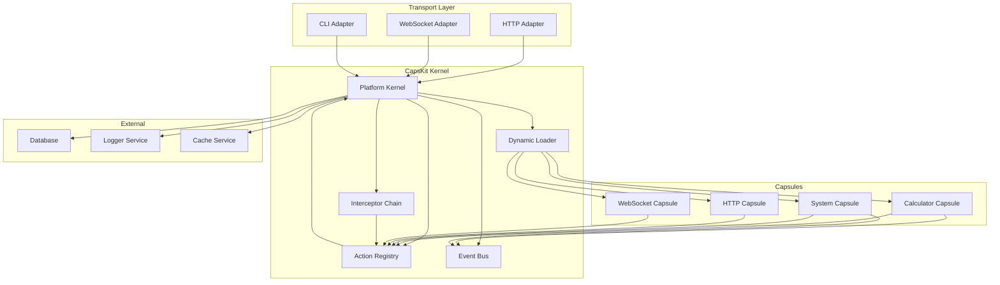
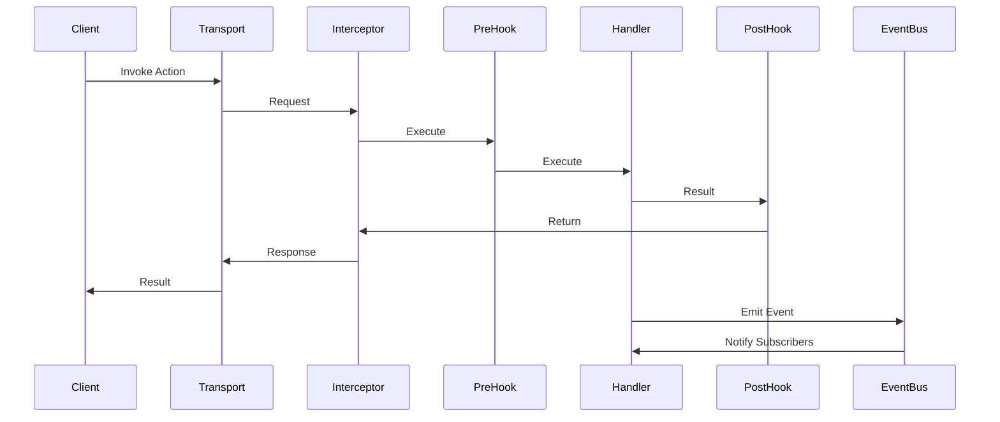

# CapsKit Capsule Architecture Analysis

## Executive Summary

CapsKit implements a **Capability Architecture** pattern that decouples business logic from transport layers through a capsule-based system. This analysis examines the current implementation, compares it with popular design patterns, and provides recommendations for making the design solid and comparable to industry-standard approaches.

---

## Current Architecture Overview

### Core Components

#### 1. Capsule Manifest System
- **Location**: [`src/types.ts`](src/types.ts:1-11)
- **Purpose**: Defines the contract for capsules
- **Key Elements**:
  - `name`: Unique identifier
  - `requires`: Dependency declarations
  - `actions`: Business logic handlers
  - `events`: Event publishing/subscribing
  - Extensible metadata (routes, traits, etc.)

#### 2. Platform Kernel
- **Location**: [`src/kernel/platform.ts`](src/kernel/platform.ts:10-189)
- **Purpose**: Central orchestration and execution engine
- **Key Features**:
  - Action registration and dispatch
  - Dependency injection
  - Interceptor chain (middleware pattern)
  - Event bus implementation
  - Capsule discovery and loading

#### 3. Dynamic Loader
- **Location**: [`src/kernel/loader.ts`](src/kernel/loader.ts:5-43)
- **Purpose**: Discovers and loads capsules from directories
- **Mechanism**: File system scanning with dynamic imports

#### 4. Action Execution Pipeline
- **Location**: [`src/kernel/platform.ts`](src/kernel/platform.ts:104-152)
- **Flow**: Interceptors -> Pre-hooks -> Handler -> Post-hooks
- **Pattern**: Chain of responsibility with middleware

---

## Architecture Strengths

### 1. Transport Agnostic Design
- Capsules contain pure business logic without HTTP/framework coupling
- Actions can be invoked via HTTP, WebSocket, CLI, or internal calls
- Example: [`capskit-calculator`](src/capsules/capskit-calculator/manifest.ts:4-35) works identically across all transports

### 2. Declarative Configuration
- Routing, traits, and events defined in manifests
- Separation of concerns: logic vs. configuration
- Example: [`calculator routes`](src/capsules/capskit-calculator/manifest.ts:22-31)

### 3. Extensible Pipeline
- Global interceptors for cross-cutting concerns
- Action-level hooks for specific logic
- Example: [`interceptor in test`](test/verify.test.ts:29-36)

### 4. Event-Driven Communication
- Loose coupling between capsules
- Async event publishing/subscribing
- Example: [`calculator events`](src/capsules/capskit-calculator/manifest.ts:32-34)

### 5. Dependency Injection
- External dependencies injected via config
- Capsules declare requirements
- Example: [`http capsule requires`](src/capsules/http/manifest.ts:6)

---

## Comparison with Popular Patterns

### 1. Plugin Architecture (e.g., VS Code, WordPress)

**Similarities**:
- Both use manifests/metadata for registration
- Dynamic loading and discovery
- Extensible through hooks

**Differences**:
- CapsKit focuses on business logic capabilities, not UI extensions
- CapsKit has built-in transport adapters (HTTP, WebSocket)
- CapsKit emphasizes transport-agnostic execution

**Recommendation**: Add plugin lifecycle hooks (install, activate, deactivate)

### 2. Microservices (e.g., Kubernetes, Docker)

**Similarities**:
- Service boundaries defined by capsules
- Event-driven communication
- Independent deployment potential

**Differences**:
- CapsKit runs in-process (single runtime)
- No network overhead or service discovery
- Shared memory/state

**Recommendation**: Consider distributed mode for scaling

### 3. Module System (e.g., ES Modules, CommonJS)

**Similarities**:
- Encapsulation of functionality
- Import/export patterns
- Dependency management

**Differences**:
- CapsKit adds runtime metadata and routing
- CapsKit provides execution context and hooks
- CapsKit has built-in event system

**Recommendation**: Add module versioning and semver support

### 4. Middleware Pattern (e.g., Express, Koa)

**Similarities**:
- Interceptor chain implementation
- Pre/post hooks
- Request/response transformation

**Differences**:
- CapsKit interceptors are action-level, not request-level
- CapsKit separates transport from logic
- CapsKit provides universal context

**Recommendation**: Add error handling interceptors

### 5. CQRS (Command Query Responsibility Segregation)

**Similarities**:
- Actions as commands/queries
- Event publishing after state changes
- Separation of concerns

**Differences**:
- CapsKit doesn't enforce read/write separation
- CapsKit actions can be both commands and queries
- No built-in event sourcing

**Recommendation**: Add CQRS annotations to actions

---

## Critical Gaps and Recommendations

### 1. Error Handling and Resilience

**Current State**:
- Basic try-catch in adapters
- No retry mechanisms
- No circuit breakers
- No dead letter queues

**Recommendations**:
```typescript
// Add to ActionDefinition
interface ActionDefinition {
  handler: string | ActionHandler;
  description?: string;
  pre?: ActionPreHook[];
  post?: ActionPostHook[];
  retry?: {
    maxAttempts: number;
    backoff: 'exponential' | 'linear';
    delay: number;
  };
  timeout?: number;
  fallback?: ActionHandler;
}
```

### 2. Validation and Schema

**Current State**:
- Manual validation in handlers
- No schema validation
- No type safety at runtime
- Example: [`sum validation`](src/capsules/capskit-calculator/src/actions/sum.ts:6-8)

**Recommendations**:
```typescript
// Add to ActionDefinition
interface ActionDefinition {
  // ... existing fields
  schema?: {
    input?: z.ZodSchema<any>;
    output?: z.ZodSchema<any>;
  };
}

// Auto-validate in pipeline
if (actionDef.schema?.input) {
  payload = actionDef.schema.input.parse(payload);
}
```

### 3. State Management

**Current State**:
- No built-in state management
- Capsules are stateless
- No caching mechanism
- No session handling

**Recommendations**:
```typescript
// Add state context
interface ActionContext {
  // ... existing fields
  state: {
    get: (key: string) => any;
    set: (key: string, value: any) => void;
    delete: (key: string) => void;
  };
  cache: {
    get: (key: string) => Promise<any>;
    set: (key: string, value: any, ttl?: number) => Promise<void>;
  };
}
```

### 4. Security and Authorization

**Current State**:
- Traits system exists but not enforced
- No built-in authentication
- No role-based access control
- Example: [`auth trait`](src/capsules/capskit-calculator/manifest.ts:28)

**Recommendations**:
```typescript
// Add security metadata
interface ActionDefinition {
  // ... existing fields
  security?: {
    auth?: boolean;
    roles?: string[];
    permissions?: string[];
    rateLimit?: {
      window: number;
      max: number;
    };
  };
}

// Enforce in interceptors
capskit.addInterceptor(async (actionName, payload, context, next) => {
  const actionDef = getActionDef(actionName);
  if (actionDef.security?.auth) {
    await authenticate(context);
  }
  return next();
});
```

### 5. Observability

**Current State**:
- Basic console logging
- No structured logging
- No metrics collection
- No distributed tracing

**Recommendations**:
```typescript
// Add observability context
interface ActionContext {
  // ... existing fields
  logger: {
    info: (msg: string, meta?: any) => void;
    error: (msg: string, error?: any) => void;
    debug: (msg: string, meta?: any) => void;
  };
  metrics: {
    increment: (name: string, value?: number) => void;
    timing: (name: string, duration: number) => void;
  };
  trace: {
    id: string;
    span: (name: string) => Span;
  };
}
```

### 6. Testing and Mocking

**Current State**:
- Basic test file exists
- No mocking utilities
- No test helpers
- Example: [`verify.test.ts`](test/verify.test.ts:1-50)

**Recommendations**:
```typescript
// Add testing utilities
interface CapsKitTestUtils {
  mockAction(capsule: string, action: string, handler: ActionHandler): void;
  resetMocks(): void;
  getActionCalls(capsule: string, action: string): Call[];
  getEvents(): Event[];
}

// Provide in test mode
const { capskit, testUtils } = createCapsKit({
  mode: 'test'
});
```

### 7. Documentation and Discovery

**Current State**:
- Description field in actions
- No API documentation generation
- No schema documentation
- No interactive playground

**Recommendations**:
```typescript
// Add documentation generator
interface CapsKitDocs {
  generateOpenAPI(): OpenAPISpec;
  generateMarkdown(): string;
  generateTypeScript(): string;
  serveDocs(port: number): void;
}

// Auto-generate from manifests
const docs = capskit.getDocs();
docs.serveDocs(3001);
```

### 8. Versioning and Compatibility

**Current State**:
- No versioning system
- No backward compatibility checks
- No migration support
- No deprecation warnings

**Recommendations**:
```typescript
// Add versioning to manifests
interface CapsuleManifest {
  name: string;
  version: string;
  compatibility?: {
    minCapsKitVersion: string;
    deprecated?: boolean;
    deprecatedIn?: string;
    removeIn?: string;
  };
  // ... existing fields
}

// Validate on load
if (!isCompatible(manifest, capskitVersion)) {
  throw new Error(`Incompatible capsule version`);
}
```

### 9. Performance and Optimization

**Current State**:
- No caching of action lookups
- No connection pooling
- No lazy loading
- No hot reload

**Recommendations**:
```typescript
// Add performance features
interface CapsKitConfig {
  // ... existing fields
  performance?: {
    cacheActions?: boolean;
    lazyLoadCapsules?: boolean;
    hotReload?: boolean;
    connectionPool?: {
      max: number;
      min: number;
    };
  };
}
```

### 10. Developer Experience

**Current State**:
- Manual capsule creation
- No scaffolding tools
- No code generation
- No IDE integration

**Recommendations**:
```typescript
// Add CLI tools
npx capskit create capsule my-capsule
npx capskit generate action sum
npx capskit validate
npx capskit docs

// Add VS Code extension
// - Syntax highlighting for manifests
// - Auto-completion for actions
// - Go to definition
// - Inline documentation
```

---

## Architecture Diagram



---

## Action Execution Flow



---

## Priority Recommendations

### High Priority (Critical for Production)

1. **Error Handling**: Add retry, timeout, and fallback mechanisms
2. **Validation**: Implement schema validation for inputs/outputs
3. **Security**: Add authentication, authorization, and rate limiting
4. **Observability**: Implement structured logging and metrics

### Medium Priority (Important for Adoption)

5. **State Management**: Add caching and session handling
6. **Documentation**: Auto-generate API documentation
7. **Testing**: Provide testing utilities and mocks
8. **Versioning**: Implement version compatibility checks

### Low Priority (Nice to Have)

9. **Performance**: Add caching, lazy loading, and hot reload
10. **Developer Experience**: Create CLI tools and IDE extensions

---

## Comparison Matrix

| Feature | CapsKit | Plugins | Microservices | Modules | Middleware |
|---------|---------|---------|---------------|---------|------------|
| Transport Agnostic | Yes | No | No | No | No |
| Dynamic Loading | Yes | Yes | No | Yes | No |
| Event System | Yes | Limited | Yes | No | No |
| Dependency Injection | Yes | Limited | No | No | No |
| Interceptors | Yes | Yes | No | No | Yes |
| Schema Validation | No | No | No | No | No |
| Error Handling | Basic | Yes | Yes | No | Yes |
| Security | Basic | Yes | Yes | No | Yes |
| Observability | Basic | Yes | Yes | No | Yes |
| Versioning | No | Yes | Yes | Yes | No |
| Documentation | Basic | Yes | Yes | No | No |

---

## Deep Pattern Analysis

### Where CapsKit Excels

#### 1. **Transport Agnostic Execution** (Unique Strength)
CapsKit's most significant innovation is the complete decoupling of business logic from transport layers. No other pattern provides this level of flexibility:

```typescript
// Same action works across all transports
await capskit.call('calculator.sum', { a: 5, b: 3 }); // Internal call
// HTTP: POST /calculator/sum
// WebSocket: ws://localhost/calculator/sum
// CLI: capskit calculator.sum 5 3
```

**Why this matters:**
- Business logic can be tested without HTTP frameworks
- Same codebase can serve multiple interfaces (web, mobile, CLI)
- Easy to add new transports without modifying business logic
- Reduces framework lock-in

**Comparison:**
- **Plugins**: Tightly coupled to host application
- **Microservices**: Each service has its own transport layer
- **Modules**: No transport layer concept
- **Middleware**: Transport-specific by design

#### 2. **Declarative Manifest System**
CapsKit uses manifests to define behavior declaratively, separating configuration from code:

```typescript
// manifest.ts
export const manifest: CapsuleManifest = {
  name: 'calculator',
  actions: {
    sum: {
      handler: './actions/sum',
      routes: [{ path: '/sum', method: 'POST' }],
      traits: ['auth', 'rateLimit']
    }
  }
};
```

**Why this matters:**
- Self-documenting code structure
- Easy to generate API documentation
- Runtime introspection capabilities
- Tooling can analyze manifests without executing code

**Comparison:**
- **Plugins**: Often use code-based registration
- **Microservices**: Configuration scattered across services
- **Modules**: No declarative metadata
- **Middleware**: Code-based middleware chains

#### 3. **Built-in Event System**
CapsKit provides a first-class event system for loose coupling:

```typescript
// Publisher
context.emit('calculator.calculated', { result: 8 });

// Subscriber
events: {
  'calculator.calculated': './handlers/onCalculated'
}
```

**Why this matters:**
- Capsules can react to state changes without direct coupling
- Enables event-driven architecture patterns
- Supports async workflows and notifications
- No external message queue needed for simple use cases

**Comparison:**
- **Plugins**: Limited event systems
- **Microservices**: Require external message brokers (Kafka, RabbitMQ)
- **Modules**: No event system
- **Middleware**: No event concept

#### 4. **Dependency Injection with Requirements**
Capsules declare dependencies, and the platform injects them:

```typescript
// Capsule declares requirement
requires: ['capskit', 'database'],

// Platform injects dependencies
const capskit = createCapsKit({
  dependencies: {
    database: dbConnection,
    logger: loggerService
  }
});
```

**Why this matters:**
- Clear dependency graph
- Easy to test with mocks
- Supports different environments (dev, staging, prod)
- Prevents circular dependencies

**Comparison:**
- **Plugins**: Often use global state or service locators
- **Microservices**: Network-based dependencies
- **Modules**: Import-based dependencies (compile-time)
- **Middleware**: No dependency injection

#### 5. **Extensible Pipeline with Hooks**
CapsKit provides multiple extension points:

```typescript
// Global interceptors
capskit.addInterceptor(async (action, payload, ctx, next) => {
  console.log(`Calling ${action}`);
  return next();
});

// Action-level hooks
actions: {
  sum: {
    pre: [validateInput],
    post: [logResult],
    handler: './actions/sum'
  }
}
```

**Why this matters:**
- Cross-cutting concerns (logging, auth, caching) can be added globally
- Action-specific behavior can be customized
- Pipeline is composable and testable
- Supports AOP (Aspect-Oriented Programming) patterns

**Comparison:**
- **Plugins**: Hook systems vary by platform
- **Microservices**: Sidecar patterns for cross-cutting concerns
- **Modules**: No pipeline concept
- **Middleware**: Pipeline is the core concept

---

### Where CapsKit Fails

#### 1. **Error Handling and Resilience** (Critical Gap)
CapsKit lacks production-grade error handling:

**Current State:**
```typescript
// Basic try-catch in adapters
try {
  const result = await capskit.call(action, payload);
  return result;
} catch (error) {
  return { error: error.message };
}
```

**What's Missing:**
- No retry mechanisms for transient failures
- No circuit breakers for cascading failures
- No dead letter queues for failed events
- No timeout handling
- No fallback strategies
- No error classification (transient vs. permanent)

**Impact:**
- System is fragile in production
- No resilience to network failures
- Difficult to debug distributed issues
- No graceful degradation

**Comparison:**
- **Plugins**: Often have robust error handling
- **Microservices**: Use circuit breakers, retries, DLQs
- **Modules**: No error handling needed
- **Middleware**: Error handling is core feature

#### 2. **Schema Validation and Type Safety** (Critical Gap)
CapsKit has no runtime validation:

**Current State:**
```typescript
// Manual validation in handlers
export const sum = async (payload: { a: number, b: number }) => {
  if (typeof payload.a !== 'number' || typeof payload.b !== 'number') {
    throw new Error('Invalid input');
  }
  return { result: payload.a + payload.b };
};
```

**What's Missing:**
- No automatic schema validation
- No runtime type checking
- No input sanitization
- No output validation
- No schema documentation
- No contract testing

**Impact:**
- Type errors only caught at runtime
- No API contract enforcement
- Difficult to generate accurate documentation
- Security vulnerabilities from unvalidated input

**Comparison:**
- **Plugins**: Varies, often have validation
- **Microservices**: Use OpenAPI, gRPC, protobuf
- **Modules**: Compile-time type checking
- **Middleware**: Often have validation middleware

#### 3. **Security and Authorization** (Critical Gap)
CapsKit has security traits but no enforcement:

**Current State:**
```typescript
// Traits exist but not enforced
routes: [{
  path: '/sum',
  method: 'POST',
  traits: ['auth', 'rateLimit']
}]
```

**What's Missing:**
- No built-in authentication
- No role-based access control (RBAC)
- No permission system
- No rate limiting enforcement
- No input sanitization
- No CSRF protection
- No security headers

**Impact:**
- Security is left to developers
- No default secure configuration
- Easy to create insecure APIs
- No audit trail

**Comparison:**
- **Plugins**: Often have security frameworks
- **Microservices**: Use OAuth, JWT, service mesh
- **Modules**: No security concept
- **Middleware**: Security middleware is common

#### 4. **Observability and Monitoring** (Critical Gap)
CapsKit has basic console logging only:

**Current State:**
```typescript
// Basic console logging
console.log(`Action ${action} called with`, payload);
```

**What's Missing:**
- No structured logging
- No metrics collection
- No distributed tracing
- No performance monitoring
- No error tracking
- No alerting
- No dashboards

**Impact:**
- Difficult to debug production issues
- No visibility into system health
- Cannot measure performance
- No proactive monitoring

**Comparison:**
- **Plugins**: Often have telemetry
- **Microservices**: Use Prometheus, Grafana, Jaeger
- **Modules**: No observability needed
- **Middleware**: Often have logging middleware

#### 5. **State Management** (Important Gap)
CapsKit is stateless with no built-in state management:

**Current State:**
```typescript
// No state management
export const sum = async (payload) => {
  return { result: payload.a + payload.b };
};
```

**What's Missing:**
- No caching mechanism
- No session handling
- No state persistence
- No distributed state
- No state synchronization

**Impact:**
- Every action is a cold start
- No optimization for repeated calls
- Difficult to implement workflows
- No user sessions

**Comparison:**
- **Plugins**: Often have state management
- **Microservices**: Use Redis, databases
- **Modules**: No state concept
- **Middleware**: Often have session middleware

#### 6. **Testing and Mocking** (Important Gap)
CapsKit has limited testing utilities:

**Current State:**
```typescript
// Basic test file
const capskit = createCapsKit();
await capskit.loadCapsules();
const result = await capskit.call('calculator.sum', { a: 5, b: 3 });
```

**What's Missing:**
- No mocking utilities
- No test helpers
- No snapshot testing
- No contract testing
- No integration testing tools
- No test fixtures

**Impact:**
- Difficult to write unit tests
- Cannot mock dependencies easily
- No test isolation
- Hard to test edge cases

**Comparison:**
- **Plugins**: Often have testing frameworks
- **Microservices**: Use contract testing, integration tests
- **Modules**: Standard testing tools
- **Middleware**: Testing utilities vary

#### 7. **Documentation and Discovery** (Important Gap)
CapsKit has basic description fields:

**Current State:**
```typescript
actions: {
  sum: {
    description: 'Add two numbers',
    handler: './actions/sum'
  }
}
```

**What's Missing:**
- No auto-generated API docs
- No interactive playground
- No schema documentation
- No example requests/responses
- No versioned documentation
- No API explorer

**Impact:**
- Manual documentation maintenance
- No discoverability
- Difficult for new developers
- No client SDK generation

**Comparison:**
- **Plugins**: Often have good documentation
- **Microservices**: Use Swagger, OpenAPI
- **Modules**: No documentation needed
- **Middleware**: Documentation varies

#### 8. **Versioning and Compatibility** (Important Gap)
CapsKit has no versioning system:

**Current State:**
```typescript
// No versioning
export const manifest: CapsuleManifest = {
  name: 'calculator',
  // ...
};
```

**What's Missing:**
- No version numbers
- No semver support
- No compatibility checks
- No migration support
- No deprecation warnings
- No breaking change detection

**Impact:**
- Cannot manage capsule versions
- No backward compatibility
- Difficult to upgrade
- Breaking changes cause failures

**Comparison:**
- **Plugins**: Often have versioning
- **Microservices**: Use API versioning
- **Modules**: Package versioning
- **Middleware**: No versioning concept

#### 9. **Performance and Optimization** (Nice to Have)
CapsKit has no performance optimizations:

**Current State:**
```typescript
// No caching or optimization
const result = await capskit.call(action, payload);
```

**What's Missing:**
- No action caching
- No lazy loading
- No hot reload
- No connection pooling
- No request batching
- No query optimization

**Impact:**
- Suboptimal performance
- Higher resource usage
- Slower startup times
- No development speed improvements

**Comparison:**
- **Plugins**: Often have optimizations
- **Microservices**: Use caching, connection pooling
- **Modules**: No performance concept
- **Middleware**: Varies by implementation

#### 10. **Developer Experience** (Nice to Have)
CapsKit has limited developer tooling:

**Current State:**
```typescript
// Manual capsule creation
// No scaffolding tools
```

**What's Missing:**
- No CLI tools
- No scaffolding
- No code generation
- No IDE integration
- No debugging tools
- No playground

**Impact:**
- Slower development
- Higher learning curve
- More boilerplate code
- Difficult onboarding

**Comparison:**
- **Plugins**: Often have good tooling
- **Microservices**: Use scaffolding, generators
- **Modules**: Standard tooling
- **Middleware**: Tooling varies

---

### Closest Pattern to CapsKit

**CapsKit is most similar to the Plugin Architecture pattern**, but with significant innovations that make it a hybrid pattern.

#### Similarities to Plugin Architecture:

1. **Dynamic Loading**: Both discover and load components at runtime
2. **Manifest/Metadata**: Both use declarative metadata for registration
3. **Extensibility**: Both extend core functionality through plugins/capsules
4. **Hooks**: Both provide hooks for customization
5. **Dependency Management**: Both manage dependencies between components

#### Key Differences from Plugin Architecture:

| Aspect | Plugin Architecture | CapsKit |
|--------|-------------------|---------|
| **Transport Layer** | Tightly coupled to host | Transport-agnostic |
| **Execution Context** | Host-specific | Universal context |
| **Event System** | Limited or none | First-class event system |
| **Dependency Injection** | Often global or service locator | Explicit requirements |
| **Routing** | Host-defined | Declarative routing |
| **Testing** | Often difficult | Easy to test (no framework) |

#### Why CapsKit is Not Pure Plugin Architecture:

1. **Transport Agnostic**: Plugins are typically tied to a specific host (VS Code, WordPress, etc.), while CapsKit capsules work across any transport
2. **Universal Execution**: Plugins execute in the host's context, while CapsKit provides a universal execution context
3. **Business Logic Focus**: Plugins often extend UI or host features, while CapsKit focuses on pure business logic
4. **Multi-Transport**: Plugins usually have one interface, while CapsKit capsules can be exposed via HTTP, WebSocket, CLI, etc.

---

### Is CapsKit a Recognized Pattern?

**CapsKit represents a hybrid pattern that combines elements from multiple established patterns:**

#### Pattern Composition:

```
CapsKit = Plugin Architecture
         + Microservices (in-process)
         + Event-Driven Architecture
         + Dependency Injection
         + Middleware Pattern
         + Capability Architecture
```

#### Unique Characteristics:

1. **Capability-Based Design**: Capsules expose capabilities, not services
2. **Transport Abstraction**: Complete separation of logic from transport
3. **Universal Context**: Actions execute in a consistent context regardless of transport
4. **Declarative Routing**: Routing defined in manifests, not code
5. **Built-in Event System**: First-class event support for loose coupling

#### Pattern Recognition:

**CapsKit is NOT currently a recognized pattern in software architecture literature**, but it has the potential to become one if:

1. **Adoption Grows**: More projects use the pattern
2. **Documentation Improves**: Clear pattern definition and best practices
3. **Community Forms**: Developers share experiences and improvements
4. **Academic Recognition**: Research papers or case studies
5. **Standardization**: Formal specification or RFC

#### Pattern Name Candidates:

- **Capability Architecture Pattern**
- **Transport-Agnostic Component Pattern**
- **Capsule Pattern**
- **Universal Capability Pattern**
- **Multi-Transport Service Pattern**

---

### Is It Worth Continuing Development?

**YES, CapsKit is worth continuing development**, but with strategic focus on critical gaps.

#### Reasons to Continue:

##### 1. **Unique Value Proposition**
CapsKit solves a real problem that other patterns don't address well:
- Testing business logic without framework coupling
- Exposing the same logic via multiple transports
- Rapid prototyping of APIs
- Building modular, extensible systems

##### 2. **Strong Foundation**
The core architecture is solid:
- Clean separation of concerns
- Extensible pipeline
- Event-driven communication
- Dependency injection
- Declarative configuration

##### 3. **Market Opportunity**
No existing pattern provides the same combination:
- Plugin systems are host-specific
- Microservices are too complex for small projects
- Module systems lack transport layers
- Middleware is framework-specific

##### 4. **Developer Experience**
CapsKit can provide excellent DX:
- Simple capsule structure
- Easy to understand
- Quick to get started
- Flexible and extensible

##### 5. **Scalability**
CapsKit can scale from small to large:
- Single capsule for simple projects
- Multiple capsules for complex systems
- Potential for distributed mode

#### Strategic Recommendations:

##### Phase 1: Critical Gaps (3-6 months)
**Focus: Production Readiness**

1. **Error Handling** (Highest Priority)
   - Implement retry mechanisms
   - Add circuit breakers
   - Create dead letter queues
   - Add timeout handling
   - Implement fallback strategies

2. **Schema Validation** (Highest Priority)
   - Integrate Zod or similar
   - Auto-validate inputs/outputs
   - Generate schemas from TypeScript types
   - Add schema documentation

3. **Security** (Highest Priority)
   - Implement authentication
   - Add RBAC
   - Enforce rate limiting
   - Add input sanitization
   - Implement security headers

4. **Observability** (Highest Priority)
   - Add structured logging
   - Implement metrics collection
   - Add distributed tracing
   - Create dashboards
   - Add alerting

##### Phase 2: Adoption Features (6-12 months)
**Focus: Developer Adoption**

5. **State Management**
   - Add caching layer
   - Implement session handling
   - Add state persistence
   - Create state synchronization

6. **Documentation**
   - Auto-generate OpenAPI specs
   - Create interactive playground
   - Add schema documentation
   - Generate client SDKs

7. **Testing**
   - Create testing utilities
   - Add mocking framework
   - Implement contract testing
   - Create test fixtures

8. **Versioning**
   - Add version numbers
   - Implement semver
   - Add compatibility checks
   - Create migration tools

##### Phase 3: Experience Improvements (12-18 months)
**Focus: Developer Experience**

9. **Performance**
   - Add action caching
   - Implement lazy loading
   - Add hot reload
   - Optimize connection pooling

10. **Developer Tools**
    - Create CLI tools
    - Add scaffolding
    - Implement code generation
    - Create IDE extensions
    - Add debugging tools

#### Success Metrics:

##### Technical Metrics:
- **Reliability**: 99.9% uptime with error handling
- **Performance**: <100ms average response time
- **Security**: Zero critical vulnerabilities
- **Test Coverage**: >90% code coverage

##### Adoption Metrics:
- **Community**: 100+ GitHub stars
- **Usage**: 10+ production deployments
- **Contributors**: 5+ active contributors
- **Documentation**: Complete API docs and guides

##### Pattern Recognition:
- **Academic**: 1+ research paper or case study
- **Industry**: Mentioned in architecture blogs
- **Standardization**: RFC or formal specification

#### Risk Mitigation:

##### Technical Risks:
- **Complexity**: Keep core simple, add features as opt-in
- **Performance**: Benchmark and optimize early
- **Security**: Security-first design, regular audits

##### Market Risks:
- **Adoption**: Focus on developer experience and documentation
- **Competition**: Emphasize unique value proposition
- **Sustainability**: Build community, not just product

#### Conclusion:

**CapsKit has strong potential to become a recognized pattern and valuable tool for developers.** The unique transport-agnostic design, combined with solid architecture foundations, provides a compelling alternative to existing patterns.

**However, success depends on:**
1. Addressing critical gaps (error handling, validation, security, observability)
2. Building excellent developer experience
3. Creating comprehensive documentation
4. Growing a community of users and contributors
5. Demonstrating real-world value through case studies

**Recommended Approach:**
- Start with Phase 1 (critical gaps) to achieve production readiness
- Gather feedback from early adopters
- Iterate based on real-world usage
- Gradually add Phase 2 and 3 features
- Document and share learnings to build pattern recognition

**Timeline:**
- **3-6 months**: Production-ready core
- **6-12 months**: Adoption-focused features
- **12-18 months**: Developer experience improvements
- **18+ months**: Pattern recognition and standardization

---

## Conclusion

CapsKit's capsule architecture is innovative and well-designed for its core purpose: decoupling business logic from transport layers. The transport-agnostic design, declarative manifests, and extensible pipeline are strong foundations.

CapsKit is most similar to the Plugin Architecture pattern but represents a hybrid pattern that combines elements from multiple established patterns. While not currently a recognized pattern, it has the potential to become one with continued development and community adoption.

**The architecture is worth continuing development** because:
- It solves a unique problem (transport-agnostic business logic)
- It has a strong foundation with clean architecture
- It fills a gap in the current pattern landscape
- It can scale from simple to complex use cases

However, to be solid and comparable with popular patterns, CapsKit needs to address critical gaps in:
- Error handling and resilience
- Validation and type safety
- Security and authorization
- Observability and monitoring
- Documentation and discovery

The recommendations above provide a roadmap for evolving CapsKit into a production-ready, enterprise-grade capability platform that can compete with established patterns while maintaining its unique strengths.

---

## Next Steps

1. Implement high-priority recommendations (error handling, validation, security)
2. Add comprehensive testing suite
3. Create documentation generator
4. Develop CLI tools for capsule creation
5. Add versioning and compatibility system
6. Implement observability features
7. Create performance benchmarks
8. Build example applications showcasing capabilities